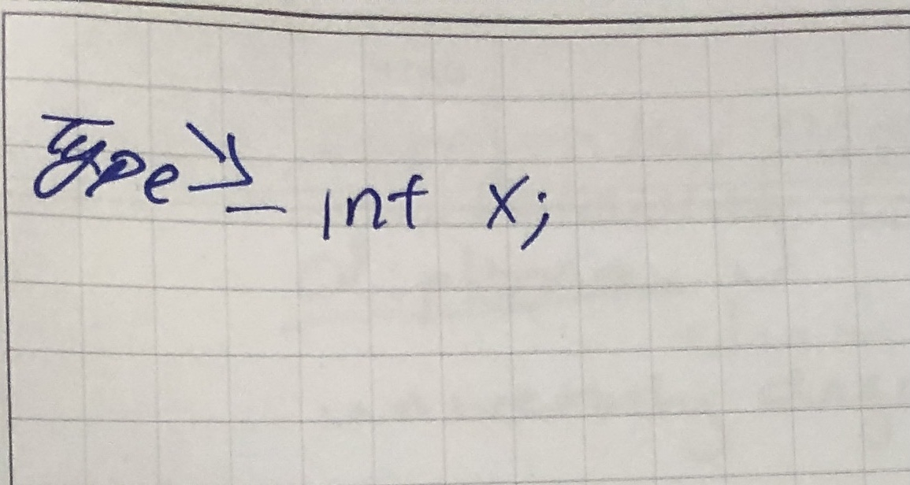
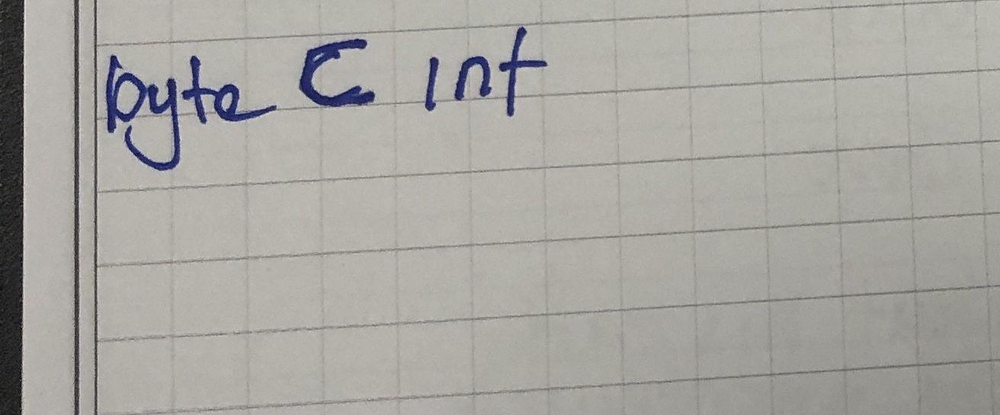
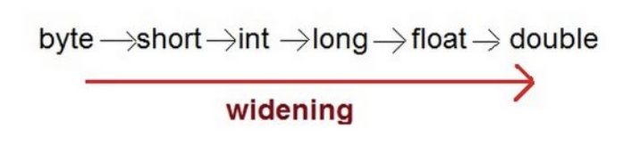
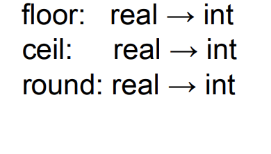

# week-4 Types and Ml tutorial by Jimmy Zhang
## introduction to types
A type is a Set of value 

In the variable n we can see that x is a varible of type int and that in-tails that n can take on any value from tne set of all integer values.
- **example:**   

The following types that are most commonly use: float, double, char, etc...

There are different kind of types like primitive type and constructed type

**Primitive type** is a type of a programmer can use but not define

**Constructed type** is a user defined type n      
  
### Supertype and Subset
A **supertype** is a subtype of an elements of a type 

what does that mean so in a language like c++ byte is a subtype of int 
we can observe:
  
- converting a value of a subtype to a values of the super-type is
called widening type conversion. (safe)
 
- converting a value of a supertype to a value of a subtype is
called narrowing type conversion. (not safe)
 
Some practice problem to https://cs.fit.edu/~ryan/sml/intro.html

### Function type 
-Functions can be passed as values; just as values that belong to other data types
-Functions belong to function types
so in ml we can consider the function type real → int
This type represents the set of all functions from real to int
other member of this type would be :

  

- Example of functions as value:

fun example (x:real):int = round(x);

val example = fn:real -> int

- Example of functions as function arguments:

fun myfun(f:real -> int) = …;

myfun(round);

myfun(ceil);

- Why do we use types?
  - types help computer languages system to assist the dev write better program 
- type mismatches indicate some sort of programming error.
**Static checking:** type checking done at compile time

**Dynamic checking:** type checking done at run time

### Type Equivalence 
- **Structural equivalence:** Names are replaced by the type expressions they define. If the resulting type expressions have the same structure, they are equivalent.
- **Name equivalence:** Names are not replaced by the type expressions they define. Two expressions are equivalent if and only if they are structurally equivalent without name substitution.

