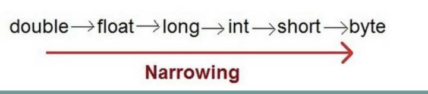
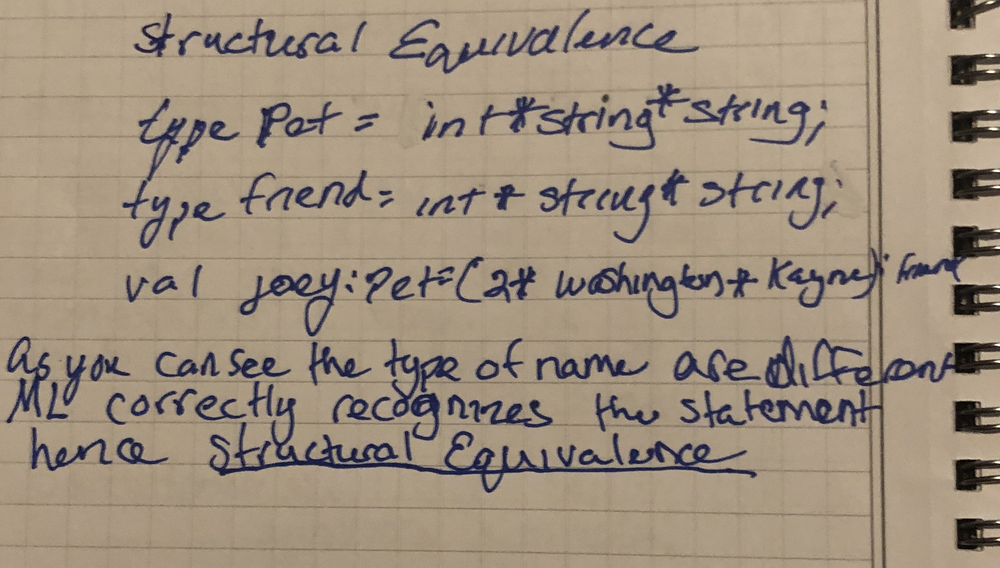

# Week-4 Types and Ml Tutorial by Jimmy Zhang
## Introduction to Types
A type is a Set of value 

In the variable n we can see that x is a varible of type int and that in-tails that n can take on any value from tne set of all integer values.
- **example:**   

The following types that are most commonly use: float, double, char, etc...

There are different kind of types like primitive type and constructed type

**Primitive type** is a type of a programmer can use but not define

**Constructed type** is a user defined type n      
  
### Supertype and Subset
A **supertype** is a subtype of an elements of a type 

what does that mean so in a language like c++ byte is a subtype of int 
we can observe:
  
- converting a value of a subtype to a values of the super-type is
called widening type conversion. (safe)
 
- converting a value of a supertype to a value of a subtype is
called narrowing type conversion. (not safe)
 
Some practice problem to https://cs.fit.edu/~ryan/sml/intro.html

### Function type 
-Functions can be passed as values; just as values that belong to other data types
-Functions belong to function types
so in ml we can consider the function type real → int
This type represents the set of all functions from real to int
other member of this type would be :

  

- Example of functions as value:

fun example (x:real):int = round(x);

val example = fn:real -> int

- Example of functions as function arguments:

fun myfun(f:real -> int) = …;

myfun(round);

myfun(ceil);

- Why do we use types?
  - types help computer languages system to assist the dev write better program 
- type mismatches indicate some sort of programming error.
**Static checking:** type checking done at compile time

**Dynamic checking:** type checking done at run time

### Type Equivalence 
- **Structural equivalence:** Names are replaced by the type expressions they define. If the resulting type expressions have the same structure, they are equivalent.
typedef link struct *cell;

 
 
- **Name equivalence:** Names are not replaced by the type expressions they define. Two expressions are equivalent if and only if they are structurally equivalent without name substitution.

typedef link struct *cell;

link next, last;

struct *cell p;

struct *cell q,r;

## Patterns
Patterns take on many appearances, such as:

Constants: 150
Variables: x
Tuples: (true, _)
Constructors (which may contain other patterns):
Lists: x::xs

val (x,y) = (1,2)

The result is that 1 gets bound to x, and 2 gets bound to y.

Pattern matching may fail. For example, the following raises exception Bind.

val 10 = 9

Besides val declarations, pattern matching is also used in function declarations

fun length nil  = 0
   |    length (x::s) = 1 + length(s);

### Syntax 'let'

'let' limit the score of the definition
fun reverse xs =
    let fun rev(nil, z) = z
    |         rev(y::ys, z) = rev(ys, y::z)
    in rev( xs, nil )
end;

### merge sort
fun mergeSort [] = []

  | mergeSort [a] = [a]
  
  | mergeSort theList =
  
      let
      
         val (x, y) = halve theList
         
      in
      
         merge(mergeSort x, mergeSort y)
         
      end;

https://en.wikipedia.org/wiki/Merge_sort

# Reference
- “Data Types.” Web.eecs.utk.edu, http://web.eecs.utk.edu/~bvanderz/teaching/cs365Sp12/notes/types.html. 
- SML, Some Basic Examples, https://cs.fit.edu/~ryan/sml/intro.html. 
- “Merge Sort.” Wikipedia, Wikimedia Foundation, 4 May 2022, https://en.wikipedia.org/wiki/Merge_sort. 
- Webber, Adam. Modern Programming Languages: A Practical Introduction. Franklin, Beedle &amp; Associates, 2011.
